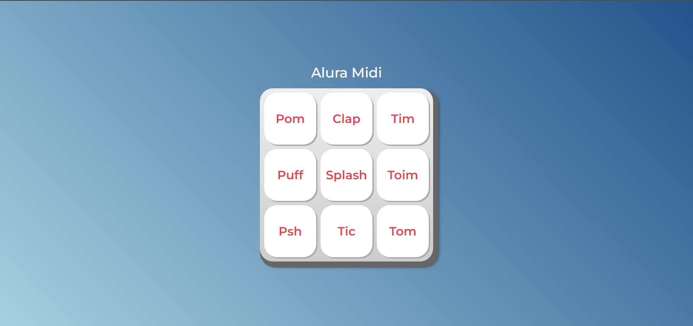

# Alura Midi

Curso da Alura voltado para o ensinamento de JavaScript, apresentando como funciona a linguagem e como integrá-la com o HTML e CSS. Consiste em um teclado em que cada tecla emite um som ao ser clicado.

## Screenshots

## Principais aprendizados

* Maior familiaridade com a linguagem
* Entendimento de algumas funções nativas

## Links

Deploy: <https://iurygon.github.io/Alura_Midi/>

Link do curso: <https://cursos.alura.com.br/course/javascript-web-paginas-dinamicas>
